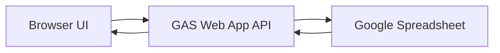
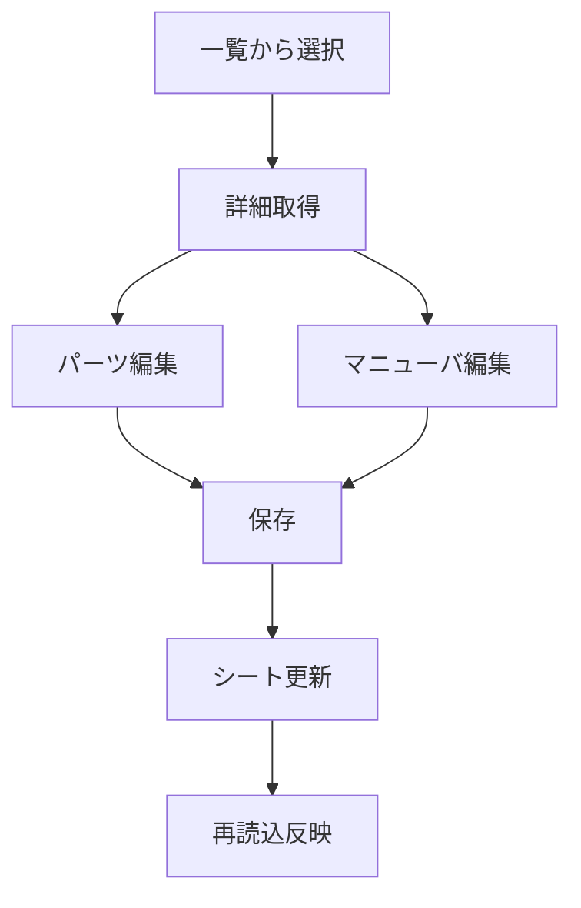

# ネクロニカ手駒管理 Web化計画

## 1. 目的

- 既存のスプレッドシートをデータベースとして利用し、ネクロニカのエネミーをキャラシ風UIで管理する
- 主操作は以下
  - マニューバの追加・削除
  - パーツの追加・削除
  - 現在状態の更新
  - Web上で表形式表示

## 1-1. 命名ルール

- 公式スペルに合わせて `nechronica` を採用する
- ページ名、JSファイル名、API action 名、変数プレフィックスは `nechronica` 系で統一する

## 1-2. 入力情報 固定値

- 既存GASコード参照先: `reference/taku_stada_gas`
- 保存先スプレッドシート: `1oa_MU-iWivWdJwHr-vqCZloXGuMQpYJcN-i5CX-aNW0`
- 公開CSV参照: `gid=1851281235`
- 既存のコマ出力JSONフォーマット
  - `kind=character`
  - `data.name`
  - `data.memo`
  - `data.initiative`
  - `data.iconUrl`
  - `data.commands`
  - `data.status`

## 2. 全体構成

## 3. データモデル

### 3-1. シート構成

- 単一シート: `nechronica_enemies`

### 3-2. 推奨カラム

- 必須カラム
  - `ID`
  - `author`
  - `name`
  - `class_type`
  - `memo`
  - `data`
  - `icon_url`
  - `time`

### 3-3. 設計方針

- 1行=1エネミーで管理する
- パーツとマニューバは `data` の JSON 文字列で保持する
- `class_type` は列として保持して一覧フィルタに使う
- `memo` は列として保持して一覧と詳細の双方で表示する
- `author` は作成者/更新者の識別用に保持する

## 4. API設計

### 4-1. 読み取り

- `GET ?action=listEnemies`
  - 一覧を返却
- `GET ?action=getEnemyDetail&enemyId=...`
  - エネミー本体 + パーツ + マニューバを返却

### 4-2. 更新

- `POST { action: saveEnemy, enemy }`
  - 1体分の全体保存
  - `enemy` 内に `parts_json` `maneuvers_json` `koma_json` を含める
- `POST { action: patchEnemy, enemyId, patch }`
  - 部分更新

### 4-4. 互換出力

- `GET ?action=exportNechronicaKoma&enemyId=...`
  - 既存フォーマット互換の `character` JSON を返却
  - `memo` と `commands` は既存の見た目ルールを維持

### 4-3. レスポンス共通

- `status`
- `message`
- `data`
- `logs`

## 5. 画面設計

## 5-1. 画面分割

- 左カラム
  - エネミー一覧
  - 新規作成ボタン
  - 検索入力
- 右カラム
  - 基本情報フォーム
  - パーツ表
  - マニューバ表
  - 保存ボタン

## 5-2. 操作フロー

## 6. CSV移行方針

- 入力元は `reference/Enj個人用メモ - 手駒.csv`
- 大量の `LET` と `XLOOKUP` 依存をそのまま移植せず、次の粒度に分解
  - エネミー本体
  - パーツ行
  - マニューバ行
- 変換ルール
  - 名前空欄行はスキップ
  - 部位不明は `part_type=other`
  - 数値不正は `0` に正規化

## 7. 実装順

1. GAS に `listEnemies` と `getEnemyDetail` を追加
2. Web 側で一覧と詳細表示を実装
3. `saveEnemy` で全体保存を実装
4. `parts_json` と `maneuvers_json` の編集UIを実装
5. `exportNechronicaKoma` で互換JSON出力を実装
6. CSV から初期データ投入スクリプトを作成
7. 単一シート運用のバリデーションを追加

## 8. 受け入れ条件

- 一覧でエネミー選択時に詳細が表示される
- パーツを追加削除して保存するとシートに反映される
- マニューバを追加削除して保存するとシートに反映される
- 部位の現在値編集が保存後に再読込で一致する
- 読み取り系 API が失敗した場合にエラー表示が出る
